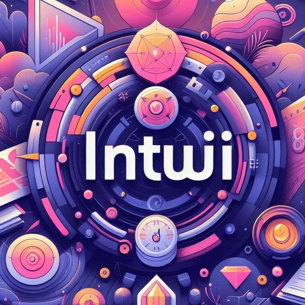

# Intuji UI Components ♾️



A collection of reusable, unit-tested, scalable UI components.

* **Tailwind CSS**-Powered: Leverages the utility-first approach of Tailwind CSS to create a modular and customizable component library.

* **TypeScript** Integrated: Employs TypeScript to ensure type safety and enhance the developer experience.

* **Tailwind Merge** for Efficient Class Composition: Utilizes Tailwind Merge to seamlessly combine Tailwind utility classes.

* **Class Variance Authority (CVA)** for Flexible Styling: Utilizes CVA to manage complex component styles and variants.

* **Vitest** for Unit Testing: Utilizes the Vitest testing framework to ensure the reliability and quality of the components.

* **Storybook** for Component Development: Integrates Storybook for isolated component development, documentation, and visual testing.


## Roadmap 🛣️

Foundational Components: Implement basic components with consistent styling and comprehensive documentation.

Advanced Components: Develop more complex components with enhanced flexibility, configurability, and optimized performance.

Data Visualization and Form Components: Integrate chart, graph, and form-related components with popular libraries and the Tailwind CSS-based design system.

Navigation and Feedback Components: Create navigation and user feedback components optimized for accessibility and smooth integration with application-level state.

Continuous Improvement and Expansion: Regularly gather user feedback, refine the component library, expand Storybook capabilities, and explore emerging front-end trends.


## Running Tests 🛠️

To run tests, run the following command

```bash
  npm run test
```


## Documentation 📃

The documentation for this Component Libraray has been deployed to Vercel at
> *https://ui-components-mu.vercel.app/*


## Deployment 🏄‍♂️

Deployed to Github Package Registry:
> *https://github.com/WEBO-Digital/ui-components/pkgs/npm/ui-components*


## Acknowledgements

 - [shadcn/ui](https://ui.shadcn.com/) 💚
 - [Class Variance Authority](https://cva.style/docs) 💚


[](https://choosealicense.com/licenses/mit/)


